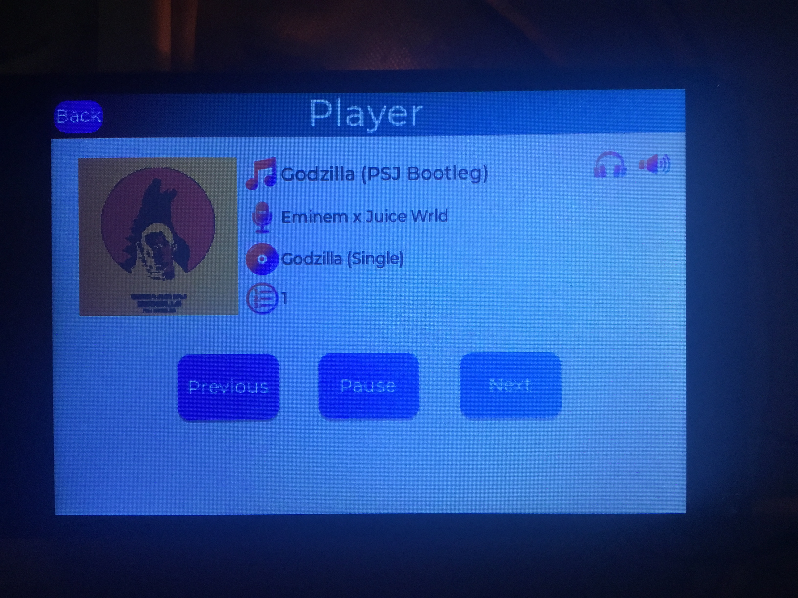
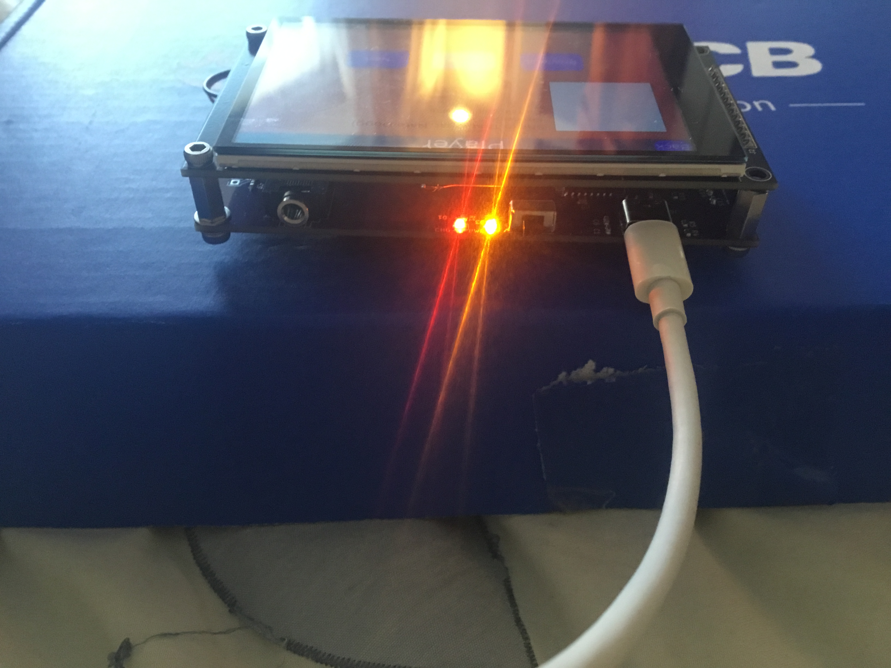
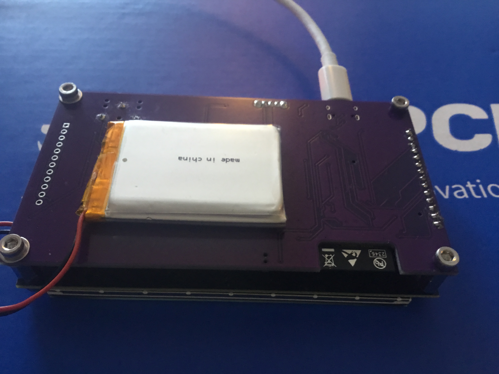

# ESP32 Audio Streaming & Playback Platform

An all-in-one **ESP32-based audio platform** providing HTTP streaming, on-device decoding, and multiple audio outputs with a full graphical UI.  
Designed for **ESP32-WROVER (8MB PSRAM)** and intended for use with a **custom PCB (v1.1)** or off-the-shelf modules.

---

## 📸 PCB – Prototype (v1.1)

  
  
  
  

**Left → Right:**  
Front view with LVGL UI • Player close-up • Angled top view • Rear view with Li-Po battery fitted

> ⚠️ **ESP32-WROVER with 8MB PSRAM is mandatory**  
> Bluetooth Classic (A2DP), audio buffers, and LVGL require PSRAM for stability.

---

## ✨ Key Features

- **Automatic MP3 & AAC codec detection** (header-level)
- **ID3v2 tag parsing**
  - Title, artist, album
  - JPEG album-art decoding
- **Bluetooth A2DP output**
  - Line-out & external sinks
  - Automatic reconnect logic
- **I2S audio output**
  - Developed using PCM5102 DAC
- **Dual-reader PCM ring buffer**
  - Independent A2DP & I2S consumption
- **LVGL graphical UI**
  - Capacitive touch support
  - ST7796 demo included
- **Transport controls**
  - Play / Pause / Stop
  - Next / Previous track

---

## 🧠 Architecture Overview

- HTTP audio streaming
- On-device MP3 / AAC decoding (Helix)
- Shared PCM buffer with dual read pointers
- Parallel audio output to:
  - Bluetooth A2DP
  - I2S DAC
- LVGL UI running primarily from PSRAM
- Designed around **FreeRTOS task separation**, flow-control, and buffer hysteresis

---

## 🖥 TFT Display Pinout (PCB v1.1 – ST7796, SPI)

The PCB v1.1 is wired for a **4″ ST7796 SPI TFT with capacitive touch**, sharing the SPI bus with the SD card.

> ⚠️ TFT and SD **share SPI lines**  
> Separate CS lines are mandatory and handled in firmware.

---

### 📌 ESP32 ↔ TFT Connections

| TFT Signal | ESP32 GPIO | ESP32 Pin # | Notes |
|------------|------------|-------------|-------|
| **VCC** | 3.3 V | — | Display power |
| **GND** | GND | — | Ground |
| **CS** | GPIO 33 | **P8** | TFT Chip select |
| **RST** | GPIO 32 | **P7** | TFT reset |
| **DC/RS** | GPIO 27 | **P13** | TFT DC/RS |
| **MOSI** | GPIO 23 | **P37** | VSPI MOSI |
| **SCK** | GPIO 18 | **P30** | VSPI CLK |
| **BL** | GPIO 25 | **P10** | TFT Backlight - PWM capable |
| **MISO** | GPIO 34 | **P37** | VSPI MISO |

---

### ✋ Capacitive Touch Controller (I²C)

(FT6236 / GT911 class controller)

| Touch Signal | ESP32 GPIO | ESP32 Pin # | Notes |
|--------------|------------|-------------|-------|
| **SCL** | GPIO 22 | **P36** | I²C Clock |
| **RST** | GPIO 26 | **P11** | Touch reset |
| **SDA** | GPIO 21 | **P33** | I²C Data |
| **INT** | GPIO 39 | **P4** | Touch interrupt (input-only) |

---

### 💾 SD Card (Shared SPI Bus)

| SD Signal | ESP32 GPIO | ESP32 Pin # | Notes |
|-----------|------------|-------------|-------|
| **VCC** | 3.3 V | — | Power |
| **GND** | GND | — | Ground |
| **CS** | GPIO 5 | **P29** | SD Card Chip Select |
| **SCK** | GPIO 18 | **P30** | Shared VSPI Clock |
| **MOSI** | GPIO 23 | **P37** | Shared VSPI MOSI |
| **MISO** | GPIO 34 | **P5** | Shared VSPI MISO |

---

## 🔌 Expansion Header (PCB v1.1)

Unused GPIOs are exposed via an **Expansion Header** for future peripherals (encoders, buttons, sensors, GPIO).

| Expansion | ESP32 GPIO | ESP32 Pin # | Notes |
|-----------|------------|-------------|-------|
| **3.3V** | 3.3 V | — | Power Output |
| **GND** | GND | — | Ground |
| **SDA** | GPIO 21 | **P33** | I²C SDA (shared with Touch) |
| **SCL** | GPIO 22 | **P36** | I²C SCL (shared with Touch) |
| **SD_CS** | GPIO 5 | **P29** | GPIO if SD not used (strap pin – don’t drive at boot)|
| **GPIO 4** | GPIO 4 | **P26** | GPIO (strap behaviour – keep low/floating at boot)|
| **GPIO 15** | GPIO 15 | **P14** | GPIO (strap pin – must be LOW at boot) |
| **GPIO 19** | GPIO 19 | **P31** | GPIO |
| **GPIO 35** | GPIO 35 | **P6** | Input-only (ADC)|
| **GPIO 36** | GPIO 36 | **P3** | Input-only (ADC)|
| **3.3V** | 3.3 V | — | Power output |
| **GND** | GND | — | Ground |

---

### ⚠️ Electrical & Boot Notes

⚠️ Use with care
GPIO 4, 5 & 15 → boot strap pins (must not be driven during reset)
Must be LOW or floating at boot

GPIO 34 / 39 → input-only, no pullups

❌ Output not possible
GPIO 34–39

---

## ⚠️ Known Issues & Limitations

- **LVGL + Bluetooth + Wi-Fi are extremely DRAM-heavy**
  - LVGL buffers must reside mostly in PSRAM
  - Moving `lvbuf1` to DRAM can crash Wi-Fi + BT
  - Use 4 lines maximum
- **Dual buffering in PSRAM is slower**
  - Trade-off required for system stability
- **Wi-Fi coexistence instability**
  - Occasional crashes under heavy load
- **ESP-IDF versions**
  - Rolled back to **ESP32 core v6.4.0** for stability
  - Newer versions attempt BT sleep → A2DP instability
- **Bluetooth**
  - Seems stable

---

## 🧪 Current Testing Status

- Use stable branch for latest stable

- Use main branch for latest code. 

⚠️ - This may be broken if I am making changes.

---

## 🛠 To-Do

- Plex Media Server integration
- General bug fixes & cleanup
- Ogg Vorbis support
- Improved AAC decoding
- LVGL dual buffering in DRAM (if feasible)

---

## ✅ Pros

- Stable during extended playback
- Robust codec detection
- Clean separation of decode and output paths
- Scales well with PSRAM availability

---

## 📦 Recommended Development Kit (Without PCB)

### ESP32 Module

**ESP32-WROVER (8MB PSRAM + TF Card)**  
- https://www.aliexpress.com/item/32879370278.html

### Display

**4″ TFT Capacitive Touch Display (ST7796)**  
- https://www.aliexpress.com/item/1005006698127763.html

### Audio DAC

**PCM5102 I2S DAC**  
Stereo RCA + headphone / line-out  
- https://www.aliexpress.com/item/1005005352684938.html

---

## 📄 License

**Project status:** Active Development

**License:**  
Free for **personal, educational, and hobbyist use**.

**Commercial use is not permitted without explicit written permission from the author.**  
This includes (but is not limited to) commercial products, services, or redistributed hardware.

If you wish to use this project commercially, please contact the author via GitHub.

---

## 🙌 Acknowledgements

- ESP32 Arduino Core  
- LVGL Graphics Library  
- Helix Audio Codecs  
